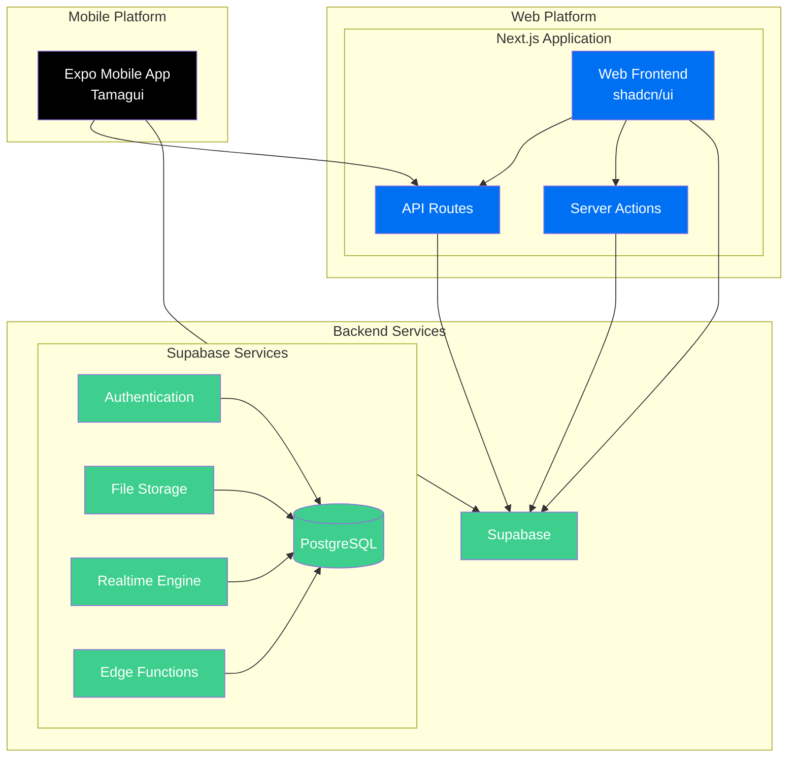

# Architecture Overview

This document outlines the technical architecture of a Next.js, Expo, and Supabase template for building full-stack web and mobile applications. This project provides a comprehensive foundation for building cross-platform applications with a modern tech stack.

## System Architecture



## Core Components

### Frontend Applications

#### Web Application (Next.js)

- **Framework**: Next.js 15 with App Router
- **UI Library**: shadcn/ui for consistent design
- **State Management**: Legend State for global state
- **Authentication**: Supabase Auth with SSR support
- **API Integration**: Direct Supabase client + API routes

#### Mobile Application (Expo)

- **Framework**: Expo with Expo Router
- **UI Library**: Tamagui for native UI components
- **State Management**: Legend State for global state
- **Authentication**: Supabase Auth with secure storage
- **API Integration**: Supabase client + shared API layer

### Backend Services

#### Next.js API Routes

- Handles complex business logic
- Manages data aggregation and transformation
- Provides unified API for both web and mobile
- Implements rate limiting and request validation

#### Supabase Integration

- **Authentication**: JWT-based auth with social providers
- **Database**: PostgreSQL with RLS policies
- **Storage**: File storage with access controls
- **Realtime**: WebSocket subscriptions for live updates
- **Edge Functions**: Serverless compute for specific tasks

## State Management

### Legend State

- Shared state management between web components and mobile components
- Persistent storage capabilities
- Type-safe state definitions
- Real-time state synchronization

```typescript
// Authentication Store
export const authStore = observable({
  user: null as User | null,
  session: null as Session | null,
  isLoading: false,
});

// Notifications Store
export const notificationsStore = observable({
  notifications: [] as Notification[],
  unreadCount: 0,
  isOpen: false,
});
```

## Data Flow

1. **User Interactions**

   - UI events trigger state updates
   - State changes propagate through Legend State
   - API calls initiated through services layer

2. **API Communication**

   - REST endpoints for CRUD operations
   - WebSocket connections for real-time updates
   - File uploads through Supabase storage

3. **Data Persistence**
   - PostgreSQL for structured data
   - Supabase storage for files and media
   - Local storage for offline capabilities

## Security Architecture

### Authentication Flow

1. User signs in through Supabase Auth
2. JWT tokens stored securely
3. Tokens refreshed automatically
4. Session management handled by Supabase

### Authorization

- Row Level Security (RLS) in PostgreSQL
- Role-based access control (RBAC)
- File access permissions in Storage
- API route protection

## Folder Structure

```

apps/
├── web-app/
│ ├── app/ # Next.js app router
│ ├── components/ # React components
│ ├── services/ # API services
│ └── store/ # Legend State setup
│
├── mobile-app/
│ ├── app/ # Expo router
│ ├── components/ # React Native components
│ ├── services/ # API services
│ └── store/ # Legend State setup
│
├── supabase/
│ ├── migrations/ # Database migrations
│ ├── functions/ # Edge functions
│ └── seed/ # Seed data
│
└── shared/
├── types/ # Shared TypeScript types
├── utils/ # Shared utilities
└── store/ # Shared state definitions

```

## Development Workflow

1. **Local Development**

   - Supabase local instance
   - Next.js development server
   - Expo development server

2. **Testing Strategy**

   - Unit tests for utilities
   - Integration tests for API routes
   - E2E tests for critical flows

3. **Deployment Pipeline**
   - Staging environment for testing
   - Production deployment through Coolify
   - Database migrations through Supabase CLI
